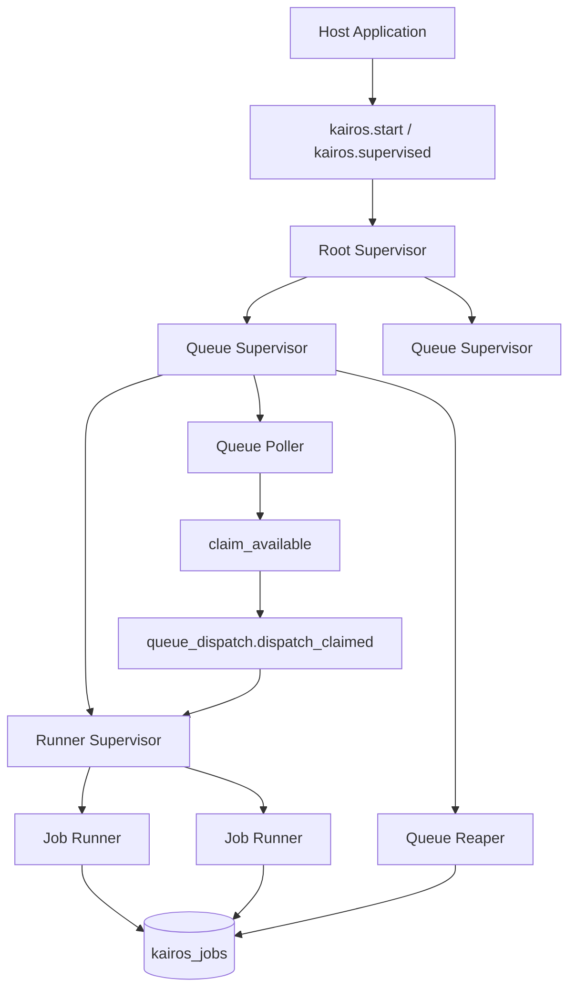
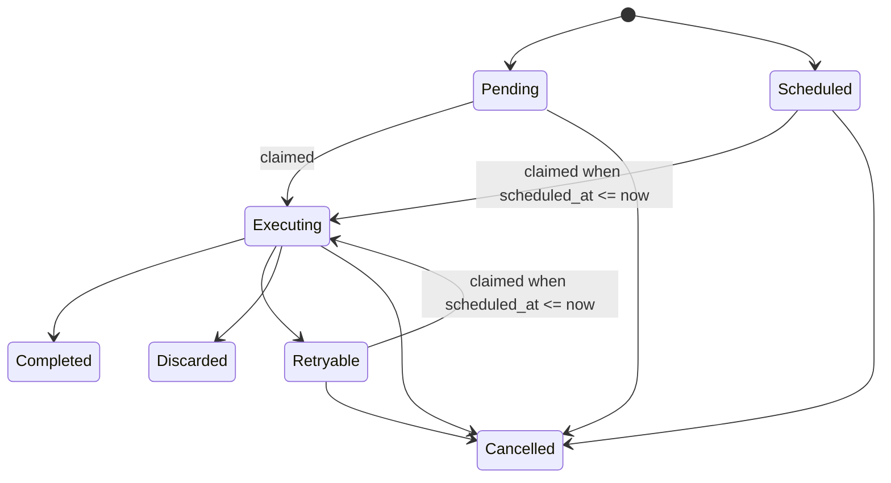

# Architecture

This page documents the current runtime shape on `main`.

## System Overview

Kairos is a PostgreSQL-backed background job runtime with four main layers:

1. Public API and domain surface
2. Supervision and queue runtime
3. Execution flow
4. PostgreSQL persistence

The public boundary is intentionally small:

- `kairos.gleam` exposes startup, enqueue, cancellation, and stale recovery
- `admin.gleam` exposes job inspection plus explicit retry and cancellation admin helpers
- `config.gleam` owns queue and worker registration for a runtime instance
- `job.gleam`, `worker.gleam`, `queue.gleam`, and `backoff.gleam` define the domain model

The runtime boundary is explicit:

- one root supervisor owns one queue supervisor per configured queue
- each queue supervisor owns a runner supervisor, a poller, and a reaper

The storage boundary is explicit:

- `postgres/job_store.gleam` owns persistence primitives
- `postgres/job_store/query.gleam` owns SQL text
- raw row decoding is isolated under `postgres/job_store/raw_job.gleam`

## Runtime Topology

## Job Flow

## Scheduling Algorithm

Kairos schedules work through one poller process per queue.

The algorithm for each queue is:

1. wait `poll_interval_ms`
2. query PostgreSQL for runnable jobs in that queue
3. claim up to `concurrency` jobs atomically
4. start one runner process per claimed job
5. schedule the next poll tick

Runnable jobs are selected by these predicates:

- `queue_name = current_queue`
- `state IN ('pending', 'scheduled', 'retryable')`
- `scheduled_at <= now`
- `attempt < max_attempts`

Claim order is explicit and stable:

1. `priority DESC`
2. `scheduled_at ASC`
3. `inserted_at ASC`

The claim query uses `FOR UPDATE SKIP LOCKED`, so concurrent claimers do not wait on the same rows and do not double-claim the same job.

Once rows are claimed, Kairos updates them to:

- `state = 'executing'`
- `attempt = attempt + 1`
- `attempted_at = now`

before starting runners.

This gives the current runtime these properties:

- scheduled jobs do not run before `scheduled_at`
- higher priority jobs are preferred when several jobs are eligible
- claim order stays testable and visible in SQL rather than being hidden in process timing
- already-claimed rows are skipped rather than contested

## Failure Detection And Recovery Algorithm

Kairos treats failure detection as a combination of immediate execution outcomes and later stale-execution recovery.

### Immediate execution outcomes

Each claimed job runs in its own runner process.
The runner resolves the persisted `worker_name`, decodes the payload, executes the worker, and then persists one lifecycle transition.

The transition rules are:

- worker returns `Success`
  move to `completed`
- worker returns `Retry(reason)`
  move to `retryable` if `attempt < max_attempts`, otherwise `discarded`
- worker returns `Discard(reason)`
  move to `discarded`
- worker returns `Cancel(reason)`
  move to `cancelled`
- payload decode fails
  move to `discarded`
- worker crashes
  move to `retryable` if retries remain, otherwise `discarded`
- worker is missing from config
  move to `discarded`

Retry scheduling is not immediate by default.
Kairos computes the next `scheduled_at` from the worker's backoff policy and the current retry context.

### Persistence failure handling

If the runner computes a retryable transition but the persistence write itself fails, Kairos attempts one recovery path:

- only retryable transitions are retried at the persistence boundary
- terminal transitions are not rewritten into different states

That keeps recovery narrow and avoids resurrecting jobs that were meant to end.

### Stale execution recovery

Kairos also has one reaper process per queue.
The reaper is not the scheduler; it is an operational recovery mechanism for jobs left in `executing`.

The recovery algorithm is:

1. compute `attempted_before = now - stale_for`
2. select stale rows in the target queue where:
   - `state = 'executing'`
   - `attempted_at IS NOT NULL`
   - `attempted_at <= attempted_before`
3. lock them with `FOR UPDATE SKIP LOCKED`
4. process them in bounded batches
5. for each stale job:
   - move to `retryable` when `attempt < max_attempts`
   - otherwise move to `discarded`

The public `kairos.recover_stale(...)` API loops batch by batch until a batch returns `0`, rather than hiding the whole backlog behind one synchronous recovery call.

This gives the recovery path these properties:

- stale detection is explicit and configurable through `stale_for`
- recovery work is bounded per batch
- stale jobs are not silently left in `executing` forever
- exhausted stale jobs become terminal instead of looping indefinitely

## Module Map

### Public boundary

- `src/kairos.gleam`
  Owns the package-level API for start, enqueue, cancel, and stale recovery.
- `src/kairos/admin.gleam`
  Owns job inspection and explicit admin mutations over persisted jobs.
- `src/kairos/job.gleam`
  Owns job state, enqueue options, and inspection-facing job snapshots.
- `src/kairos/worker.gleam`
  Owns typed worker contracts, payload decoding, and perform results.
- `src/kairos/queue.gleam`
  Owns queue configuration and validation.
- `src/kairos/backoff.gleam`
  Owns retry backoff policies.
- `src/kairos/migration.gleam`
  Exposes versioned migration data.

### Runtime boundary

- `src/kairos/supervision.gleam`
  Builds the root runtime and queue lookup surface.
- `src/kairos/supervision/queue_supervisor.gleam`
  Builds the per-queue subtree.
- `src/kairos/supervision/queue_runtime.gleam`
  Stores queue-local process names and queue settings.
- `src/kairos/runtime/queue_poller.gleam`
  Owns autonomous polling and automatic claim-and-dispatch cycles.
- `src/kairos/queue_dispatcher.gleam`
  Exposes manual dispatch for explicit control and tests.
- `src/kairos/runtime/queue_dispatch.gleam`
  Owns the shared internal dispatch path used by both pollers and manual dispatch.
- `src/kairos/runtime/queue_reaper.gleam`
  Owns stale `executing` recovery.
- `src/kairos/runtime/job_runner.gleam`
  Owns worker execution and lifecycle persistence.

### Persistence boundary

- `src/kairos/postgres/job_store.gleam`
  Owns typed persistence operations and state transition primitives.
- `src/kairos/postgres/job_store/query.gleam`
  Owns SQL text and query shape.
- `src/kairos/postgres/job_store/raw_job.gleam`
  Owns raw row decoding.
- `src/kairos/migrations/postgres*.gleam`
  Own versioned schema definition.

## Boundary Rules

The current folder structure is still clean enough to scale if new work follows these rules:

1. Keep domain concepts in `src/kairos/*.gleam`.
2. Keep process orchestration in runtime modules, not in `kairos.gleam`.
3. Keep SQL and row decoding inside `src/kairos/postgres`.
4. Keep queue polling, dispatch, execution, and stale recovery as separate concerns.
5. Keep host-application concerns outside the package.

## Current Strengths

- The public API is still narrow.
- The queue runtime shape is easy to follow.
- Automatic polling and manual dispatch share one dispatch core.
- Storage concerns are isolated from the public worker contract.

## Current Pressure Points

- the admin surface is still intentionally small and may need pagination or richer filters later
- Logging and telemetry are still minimal.
- pruning and advanced queue controls are not yet first-class.

Those are still acceptable at the current maturity level, but future work should avoid collapsing more runtime details into the top-level package module.
