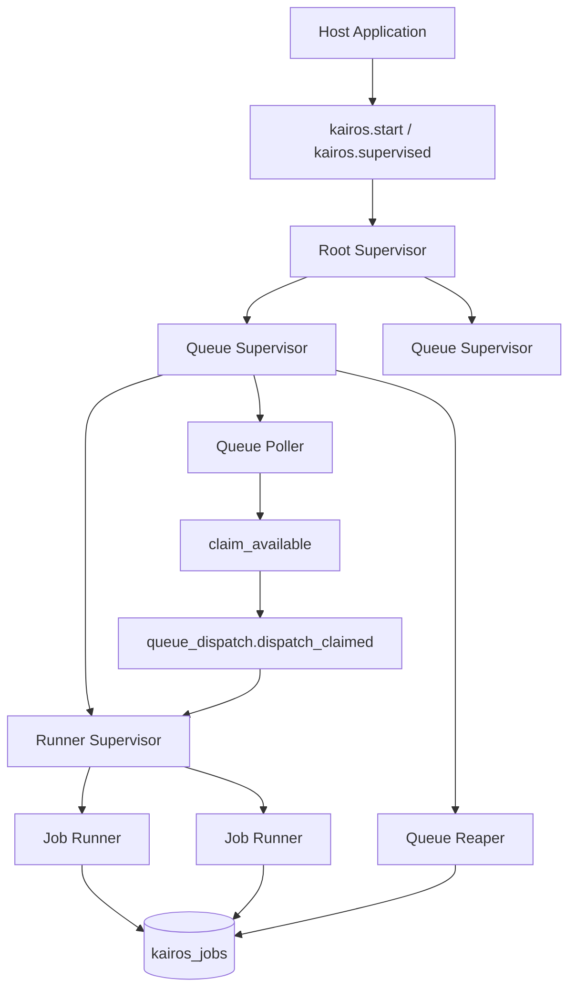
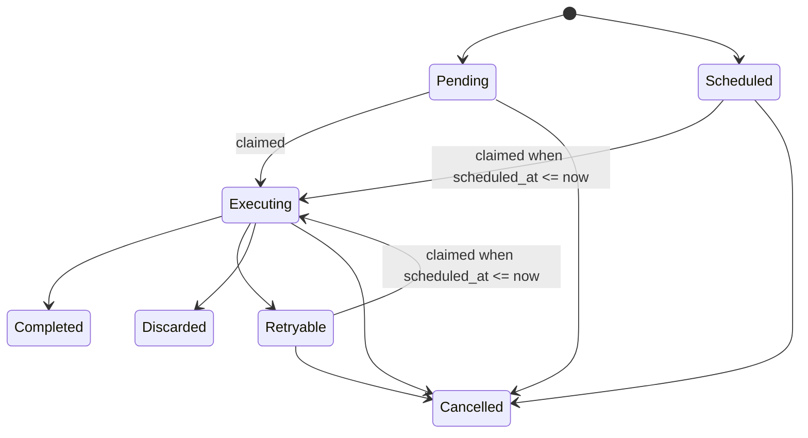

# Architecture

This page documents the current runtime shape on `main`.

## System Overview

Kairos is a PostgreSQL-backed background job runtime with four main layers:

1. Public API and domain surface
2. Supervision and queue runtime
3. Execution flow
4. PostgreSQL persistence

The public boundary is intentionally small:

- `kairos.gleam` exposes startup, enqueue, cancellation, and stale recovery
- `config.gleam` owns queue and worker registration for a runtime instance
- `job.gleam`, `worker.gleam`, `queue.gleam`, and `backoff.gleam` define the typed domain model

The runtime boundary is explicit:

- one root supervisor owns one queue supervisor per configured queue
- each queue supervisor owns a runner supervisor, a poller, and a reaper

The storage boundary is explicit:

- `postgres/job_store.gleam` owns persistence primitives
- `postgres/job_store/query.gleam` owns SQL text
- raw row decoding is isolated under `postgres/job_store/raw_job.gleam`

## Runtime Topology

## Job Flow

## Module Map

### Public boundary

- `src/kairos.gleam`
  Owns the package-level API for start, enqueue, cancel, and stale recovery.
- `src/kairos/job.gleam`
  Owns job state and enqueue options.
- `src/kairos/worker.gleam`
  Owns typed worker contracts, payload decoding, and perform results.
- `src/kairos/queue.gleam`
  Owns queue configuration and validation.
- `src/kairos/backoff.gleam`
  Owns retry backoff policies.
- `src/kairos/migration.gleam`
  Exposes versioned migration data.

### Runtime boundary

- `src/kairos/supervision.gleam`
  Builds the root runtime and queue lookup surface.
- `src/kairos/supervision/queue_supervisor.gleam`
  Builds the per-queue subtree.
- `src/kairos/supervision/queue_runtime.gleam`
  Stores queue-local process names and queue settings.
- `src/kairos/runtime/queue_poller.gleam`
  Owns autonomous polling and automatic claim-and-dispatch cycles.
- `src/kairos/queue_dispatcher.gleam`
  Exposes manual dispatch for explicit control and tests.
- `src/kairos/runtime/queue_dispatch.gleam`
  Owns the shared internal dispatch path used by both pollers and manual dispatch.
- `src/kairos/runtime/queue_reaper.gleam`
  Owns stale `executing` recovery.
- `src/kairos/runtime/job_runner.gleam`
  Owns worker execution and lifecycle persistence.

### Persistence boundary

- `src/kairos/postgres/job_store.gleam`
  Owns typed persistence operations and state transition primitives.
- `src/kairos/postgres/job_store/query.gleam`
  Owns SQL text and query shape.
- `src/kairos/postgres/job_store/raw_job.gleam`
  Owns raw row decoding.
- `src/kairos/migrations/postgres*.gleam`
  Own versioned schema definition.

## Boundary Rules

The current folder structure is still clean enough to scale if new work follows these rules:

1. Keep typed domain concepts in `src/kairos/*.gleam`.
2. Keep process orchestration in runtime modules, not in `kairos.gleam`.
3. Keep SQL and row decoding inside `src/kairos/postgres`.
4. Keep queue polling, dispatch, execution, and stale recovery as separate concerns.
5. Keep host-application concerns outside the package.

## Current Strengths

- The public API is still narrow.
- The queue runtime shape is easy to follow.
- Automatic polling and manual dispatch share one dispatch core.
- Storage concerns are isolated from the public worker contract.

## Current Pressure Points

- `kairos.gleam` is growing into a package facade for multiple operational APIs.
- Logging and telemetry are still minimal.
- Admin and inspection APIs are not yet first-class.

Those are still acceptable at the current maturity level, but future work should avoid collapsing more runtime details into the top-level package module.
